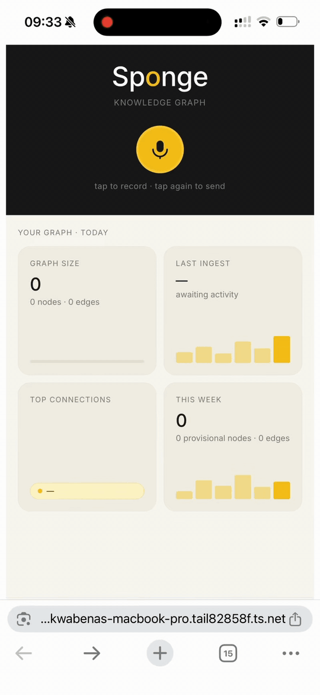

# Sponge

[](https://github.com/akaddo97/sponge/actions/workflows/ci.yml)
[](pyproject.toml)
[](LICENSE)

**Voice-first agentic UI for a personal knowledge graph.**

Tap to record on your phone → on-device transcription → the model proposes
graph mutations → you verify inline before commit → conversational briefer replies.
Self-hosted. Provider-agnostic LLM. Bring your own graph.

> *Friction is the feature.* The propose-approve-commit gate is the moat —
> the model proposes, you decide. You stay the editor of your own graph.

<p align="center">
  
</p>

## What it does

You walk down the street and record a 20-second voice memo about a person
you just met. By the time you're back at your laptop, Sponge has:

1. Transcribed the audio locally with Whisper.cpp (no audio leaves your machine).
2. Lightly cleaned the transcript (paragraph breaks, brand caps, voice preserved).
3. Asked the configured LLM to propose graph mutations (new person node, edges to
   the company they work at, a project they mentioned).
4. Committed those proposals as **provisional** entries (verified=False).
5. Replied in chat: *"Got Alice and the cafe project — flagged as a possible collaborator."*
6. Rendered an inline verify card directly under that reply, listing each
   proposed node and edge with ✓ Verify / ✗ Discard buttons — no tab-switch.

You glance at the card, tap ✓ if it looks right (or ✗ to drop it). The provisional
entries flip to verified in one shot. The full batch view at `/verify` is still
there for catching up on memos you didn't decide on in the moment.

## The flow

```
   ┌──────────────┐    ┌──────────────────┐    ┌─────────────────┐
   │  iOS Shortcut│───▶│ iCloud voice_inbox│───▶│ Mac voice_watcher│
   └──────────────┘    └──────────────────┘    └────────┬────────┘
                                                          │
                                                          ▼
   ┌──────────────────────────────────────────────────────────────┐
   │  voice_pipeline                                              │
   │   1. transcribe (Whisper.cpp local)                          │
   │   2. clean (deterministic + LLM polish, both safe-fail)      │
   │   3. propose mutations (single LLM call → JSON)              │
   │   4. commit provisional via GraphBackend                     │
   │   5. brief — short conversational reply                      │
   └──────────────────────────────┬───────────────────────────────┘
                                  ▼
                       ┌─────────────────────┐
                       │ mobile verify pane  │
                       │ (Verify / Reject)   │
                       └─────────────────────┘
```

## Why voice-first

Capture should be friction-free; review is where you spend the friction. Voice
is the lowest-friction capture surface humans have. Touch typing on a phone
loses 90% of what you would have said. Stop-and-record loses nothing.

The graph is the long-term memory. The verify pane is where you exercise
judgement. Voice is just how raw material gets in.

## Architecture

```
                   ┌──────────────────────────────────────────┐
                   │             Sponge (this repo)            │
                   │                                           │
                   │  voice_pipeline · proposer · briefer      │
                   │  app (Flask routes) · Jazz UI · watcher   │
                   └──────┬─────────────────────┬──────────────┘
                          │                     │
              GraphBackend Protocol     llm-providers
              (your choice of store)    (Claude / Gemini / OpenAI)
                          │                     │
              ┌───────────┼─────────────┐    ┌──┴─────────────────┐
              │           │             │    │                    │
       JsonFileBackend  Postgres    Neo4j    │ ANTHROPIC_API_KEY  │
       (default)        (yours)    (yours)   │ GEMINI_API_KEY     │
                                              │ OPENAI_API_KEY     │
                                              └────────────────────┘
```

Two abstraction seams:

- **`GraphBackend`** — your storage. The shipped `JsonFileBackend` writes
  a single JSON file with atomic writes and `fcntl` locking. Plenty for
  personal-scale graphs (up to ~10k nodes). Beyond that, implement
  `GraphBackend` against a real database. Sponge's pipeline doesn't care.
- **`llm-providers`** (vendored in `src/sponge/_vendored/`) — whichever
  Claude / Gemini / OpenAI you set via `LLM_PROVIDER`. Bring your own key.

## Quickstart

Sponge installs in four steps.

```bash
# 1. Clone
git clone https://github.com/akaddo97/sponge
cd sponge

# 2. Create venv
# macOS users — if your `python3` on PATH is Homebrew Python 3.13 or 3.14, `uv`
# may refuse with "platform.mac_ver() returned an empty value". Use 3.12 explicitly:
uv venv --python /opt/homebrew/opt/python@3.12/bin/python3.12 .venv
# Other systems:
# python3 -m venv .venv
source .venv/bin/activate

# 3. Install package + download Whisper model (~140 MB)
uv pip install -e ".[dev]"
bash scripts/install_whisper.sh

# 4. Configure your LLM provider, copy the demo graph, run
export ANTHROPIC_API_KEY=...   # or GEMINI_API_KEY / OPENAI_API_KEY
export LLM_PROVIDER=claude     # or gemini / openai (defaults to claude)
cp examples/demo_graph/graph.json graph.json
sponge                          # starts on http://127.0.0.1:5050
```

`pywhispercpp` is now a core dependency, so the voice pipeline works out of the
box. The legacy `pip install -e ".[whisper]"` extras still resolves (no-op alias)
for anyone with it in muscle memory.

Open `http://127.0.0.1:5050` on your laptop or — for the real demo — on your
phone via [Tailscale](https://tailscale.com/) at `http://<your-mac>.<your-tailnet>:5050`.

For the iOS Shortcut + Mac watcher setup, see [`docs/install_macos.md`](docs/install_macos.md).

## Bring your own graph

Implement `GraphBackend`:

```python
from sponge import GraphBackend

class MyPostgresBackend:
    name = "postgres"

    def add_node(self, node, *, provisional_source=None):
        # INSERT ... RETURNING id
        ...

    def commit_provisional(self, source: str) -> int:
        # UPDATE nodes SET verified = TRUE WHERE provisional_source = %s
        ...

    # ... see src/sponge/graph_backend.py for the full Protocol
```

Then wire it in:

```python
from sponge.app import create_app
from my_backend import MyPostgresBackend

app = create_app(backend=MyPostgresBackend(...))
```

## Bring your own LLM

```bash
export LLM_PROVIDER=openai          # or claude (default) or gemini
export OPENAI_API_KEY=sk-...
```

Sponge picks the provider at call time via the (vendored) `llm-providers`
abstraction. The Claude / Gemini / OpenAI translation layers handle
streaming + tool-use under the hood; voice memos use the synchronous
`complete()` path.

## What's in v0.1

- Voice memo pipeline (transcribe → clean → propose → provisional commit → brief).
- `JsonFileBackend` reference impl with atomic writes.
- Provider-agnostic LLM via vendored `llm-providers` (Claude / Gemini / OpenAI).
- Mobile Jazz UI (home + verify pane), tap-to-record mic.
- launchd user-agent for the watcher.
- Synthetic demo graph (no personal data).

## What's *not* in v0.1 (planned)

- Multi-round agentic chat (the streaming tool-using `/query` loop). v0.1
  does single-call propose; v0.2 adds the agent loop for richer extractions.
- Async voice job polling — long memos block the request thread today. Keep
  memos under ~60 s for the in-browser flow.
- iOS Shortcut binary export — the Shortcut format isn't portable across
  iCloud accounts. `docs/install_macos.md` documents how to build your own.
- Multi-user / cloud deploy. Sponge is single-user, local-network-by-default.

## Limitations

- Single-user. No auth in v0.1. Only run on a trusted network (Tailscale,
  local Wi-Fi behind your router).
- macOS-first. The watcher + launchd plist target macOS; Linux works for
  the Flask app + manual file drop, but the iCloud Shortcut path is
  Apple-platform.
- Whisper.cpp models aren't bundled (~140 MB for `ggml-base.en.bin`). Run
  `bash scripts/install_whisper.sh` after install — see Quickstart step 3.

## Roadmap

- v0.2: agentic chat loop + tool use; async voice jobs; on-device speech
  even for the search bar (not just memos).
- v0.3: multi-user with per-user graphs and OAuth.
- v0.4: native iOS app replacing the iCloud-Shortcut pipeline.

## Inspirations

Sponge sits between a few patterns:

- The personal-memory tools (Reflect, Mem, Roam) — but with friction-by-design
  on the way in. The model proposes; you commit.
- The voice-first capture tools (Otter, Granola, Audiopen) — but your data
  becomes a structured graph, not a transcript pile.
- The agentic frameworks (LangChain, LlamaIndex) — but inverted: you write
  the graph, the model proposes; not the model writes the graph, you read.

## License

MIT — see [LICENSE](LICENSE).
